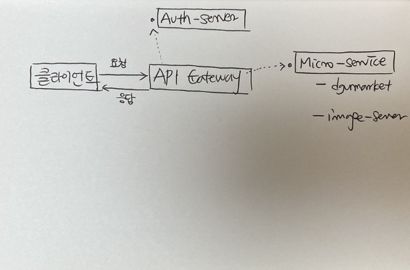

`API GATEWAY` https://github.com/taekwon-dev/dgumarket_api_gateway.git

`Authorization-Server` https://github.com/taekwon-dev/dgumarket_authorization_server.git

____

## MSA Architecture 

사실 우리 서비스에는 당장 적합하지는 않다. 실제로 이 구조로 전환하는 과정에서 잘못된 생각으로 선택한 것 같다. (시간 측면)

- MSA는 **대용량 웹서비스를 위한 마이크로 서비스** 
- 필요한 기술 스택, 개발 실력 
- 관련해서 장/단점에 관한 글 읽어보길 추천 
  - https://bcho.tistory.com/948 **마이크로 서비스 아키텍쳐 (MSA의 이해)**
  - https://bcho.tistory.com/1005 **MSA 아키텍쳐 구현을 위한 API 게이트웨이의 이해**

### 근데 왜 도입?

- 그동안 공부한 결과, 기능 또는 성능 상의 문제를 크게 야기하지 않고 경험 또는 공부 측면에서 좋은 영향 
  - 이미 현재 방식에는 숙달되어 있다. 개발의 모델 차원에서 경험해볼 다양성이 부족하다고 판단. (프론트 포함)
- 구직 시장의 흐름
  - 잡코리아 기준
  - `spring` 검색 결과 1,800~1,900 건 
  - `spring msa` 검색 결과 180~200 건 (약 10%), 대기업 (카카오, 네이버, 라인) 중심으로 수요가 많아지고 있다. 
- 현재 도입한,  토큰 기반 인증 + 메인 서버와 이미지 서버의 분리 상황에서 MSA 활용 맥락이 일부 있다는 점. 
  - API GATEWAY에서 공통된 인증 절차, 로깅 처리, 로드 밸런스, 정적 자원 호스팅 ... 
  - 확장성 (여기서 말하는 확장성 - 메인 서버를 API 서버로 구축할 수 있다는 점)  
    - API GATEWAY에서 정적 자원을 호스팅 (js, css, html을 직접 호스팅) 
    - 메인 서버는 API 요청만 처리하도록 구조화 

새로운 프로젝트 구조에서 등장하는 **요소**

`Client`

`API GATEWAY` port : 8081

`Authorization-server` port : 8082

`Micro-service-main-server` port : 8080

`Micro-service-image-server` 49.247.130.58

​							 <그림 : dgumarket architecture> 

___

**예시** : HTTP 통신 & 여러 서버 조합에서 경험할 수 있는 요소 

#Redirect (Temporary, Permanent, See Other, etc ...)

(예)

요청 - gateway server - 내 회원정보 조회 - 인증X

응답 - gateway server - 인증 과정 예외 발생 - auth-server - access token 재발급 받고 다시 요청해

요청 - auth server - access token 다시 발급해줘 

응답 - auth server - ok 

요청 - gateway server - 내 회원정보 조회 - 인증O

응답 - gateway server - ok (회원정보 반환)

___

### 가장 큰 변화  -  작업 환경 

API Gateway server : static resources hosting 

- static resources 관리 (static : js, css, html) 모두 gateway server로 이전 
- 현재 2021-02-08 기준, 2/5~2/6 chat chat image message redering 커밋까지 이전 완료한 상황 
- 개발 과정에서 login.js 18번 api 경로 수정 (-> /auth/login)
  - gateway-server에서 앞으로 개발 예정이므로 큰 상관 없을 듯 
- 한 번에 옮겨갈 수 없을 수 있지만, 일단 앞으로 프론트 개발은 gateway-server에서 진행 
  - routing 코드를 추가해서 기존에 완료된 기능 테스트 되도록 처리 할 예정 
  - 로컬에서 테스트 할 때, gateway, auth, main server 모두 빌드한 상태로 테스트 진행 
  - (참고) 현재 AWS EC2 서버에서 테스트 환경 구축 중 

___

TO 진영 

로그인 API  

Refresh API (refresh token으로 access token 발급 받기)

위 두 API 테스트를 통해 토큰 발급까지 완료한 후 인증 요구되는 요청 테스트 할 예정 (회의 때 자세히 설명 예정)

- 기존 서버에 ROUTING 하는 부분 코드 진행된 이후에 진행 할 것 
- 앞으로 인증 요구되는 요청에 대해서 API 변경되는 점은 access token을 authorization-header에 반영하는 것 외에는 없을 예정 

____

