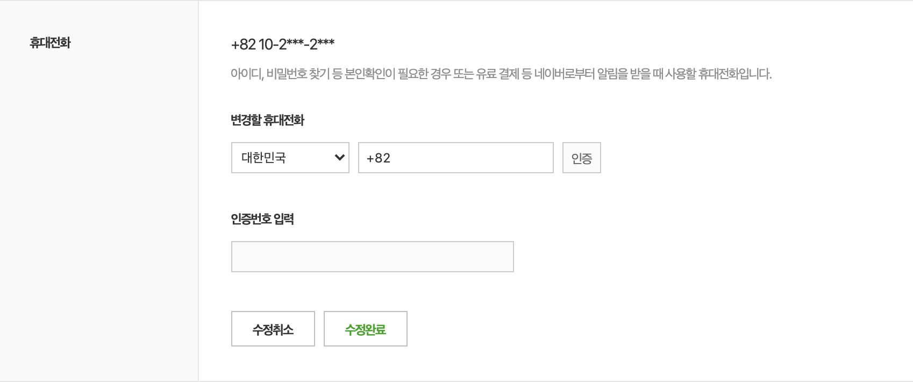

### 핸드폰 번호 변경 API


아래 두 조건을 모두 통과했을 경우 핸드폰 번호를 변경할 수 있습니다. 

- 변경할 휴대전화가 기존 핸드폰 번호와 동일하지 않은 경우 

- 새로운 핸드폰 번호에 대해서 인증 이후에 새로운 핸드폰 번호로 변경할 수 있습니다. 


핸드폰 번호 변경 API 로직 관련해서 SMS 전송 처리를 하는 핸드폰 인증문자 발송 API가 있습니다.

따라서 아래 로직에 따라서 핸드폰 번호가 변경됩니다. 

- **핸드폰 인증문자 발송 API ... (1)**
- **핸드폰 번호 변경 API ... (2)**

**UI** 

핸드폰 변경 페이지에서 기존 핸드폰 정보를 아래와 같이 보여주시면 됩니다. (API 참고)




### 1. 핸드폰 인증문자 발송 API 

**URL** : `/api/send-sms/change-phone` 

**Method** : `POST`

**Authentication** : O (Authorization Header - Access Token) / HTTP Cookie - Refresh Token

**Request Body** :  

```json
{
    "phoneNumber" : "01022292983" // - 없이 번호만 입력 
}
```

**Response** :

```json
// 인증문자 발송 성공 
[HTTP/1.1 200]
{
    "statusCode": 200,
    "message": "인증문자 발송 성공 (핸드폰번호 변경)",
    "responseData": null
}

// 인증문자 발송 실패 
// "1일 5회 이상 요청으로 인증문자 발송이 제한됩니다."
// 메시지를 안내해주시면 됩니다. 
[HTTP/1.1 200]
{
    "statusCode": 1,
    "message": "1일 5회 이상 요청 제한으로 인증문자 발송 실패",
    "responseData": null
}

// 기존 핸드폰 번호와 동일한 번호로 인증문자를 발송한 경우
// "기존 핸드폰 번호와 동일한 번호로 인증문자를 발송할 수 없습니다."
// 메시지를 안내해주시면 됩니다. 
[HTTP/1.1 200]
{
    "statusCode": 2,
    "message": "기존 핸드폰 번호와 동일한 번호로 인증문자를 발송할 수 없습니다.",
    "responseData": null
}

// 알리고 서버에서 문자 전송 실패했을 경우는 'statusCode'가 0보다 작은 경우입니다. 
// 'statusCode'가 0보다 작은 경우, 실패 사유를 확인할 수 있습니다. 

// 문자 전송 실패의 경우 
// "인증문자 발송이 실패했습니다. 다시 한 번 시도하시고 계속 문제가 있는 경우 관리자에게 문의해주세요."
// 메시지를 안내해주시면 됩니다. 
[HTTP/1.1 200 OK]
{
    "statusCode": 0 보다 작은 경우, (ex -1, -100, -102, ..)
    "timestamp": "2021-03-30T05:10:58.454+00:00",
    "message": "알리고 문자 전송 실패, 실패 사유 : API 인증오류입니다.",
    "requestPath": "/api/send-sms/change-phone",
    "pathToMove": null
}

```


### 2. 핸드폰 번호 변경 API (인증 번호 확인 절차 후 핸드폰 번호 변경 처리)

**URL** : `/api/user/profile/change-phone` 

**Method** : `POST`

**Authentication** : O (Authorization Header - Access Token) / HTTP Cookie - Refresh Token

**Request Body** :  

```json
{
    "phoneNumber" : "01000000000", // - 없이 번호만 입력
    "verificationNumber" : "000000" // 6자리 숫자
}
```

**Response** :

```json
// 핸드폰 번호 변경 성공 
[HTTP/1.1 200]
{
    "statusCode": 200,
    "message": "[인증 성공]회원 핸드폰번호 변경 성공",
    "responseData": null
}


// 핸드폰 번호 변경 실패 

// 페이지 새로 고침이 되기 전에 Alert를 통해서 "인증이 실패되었습니다. 인증문자를 새롭게 받은 후 다시 진행해주세요." 띄어주세요.
[HTTP/1.1 200]
{
    "statusCode": 1,
    "message": "[인증 실패]인증 대기 중인 핸드폰 번호, 인증 번호 정보를 찾을 수 없습니다.",
    "responseData": null
}

// 인증번호가 틀린 경우 
[HTTP/1.1 200]
{
    "statusCode": 2,
    "message": "[인증 실패]인증번호가 틀렸습니다.",
    "responseData": null
}

// 페이지 새로 고침이 되기 전에 Alert를 통해서 "인증이 실패되었습니다. 인증문자를 새롭게 받은 후 다시 진행해주세요." 띄어주세요.
{
    "statusCode": 3,
    "message": "[인증 실패]기존 핸드폰 번호와 동일한 번호로 수정할 수 없습니다.",
    "responseData": null
}
```


