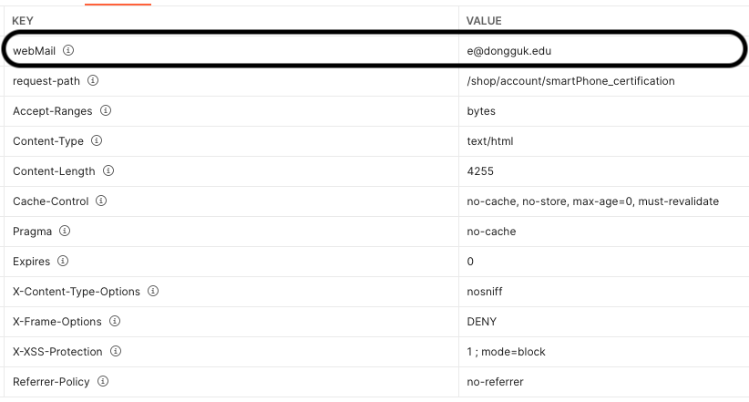

## 회원가입 2단계 - 핸드폰 인증 

회원가입 2단계에서는 아래  API가 포함됩니다.

- 핸드폰 번호 중복체크 API
- **핸드폰 인증문자 발송 API** 
- 핸드폰 인증 API 


### 핸드폰 인증문자 발송 API 

회원가입 2단계 - 유저가 입력한 핸드폰 번호로 인증 문자를 전송합니다. (핸드폰 번호 중복체크를 통과한 경우에만 인증문자를 발송할 수 있습니다.)

(인증 문자 6자리 숫자 조합)

**URL** : `/api/send-sms/verify-phone`  

**Method** : `POST`

**Authentication** : 인증 필요 X  

**Request Body** : 

```json
{
    "webMail" : "tkyoun94@naver.com", // 웹메일은 2단게 페이지 접근 시 응답 헤더에 포함되어 있습니다. (그림 1 참고)
    "phoneNumber" : "01000000000" // - 없이 숫자만 입력 
}
```




​				<그림 : 링크를 통해 회원가입 2단계 페이지 응답 정상적으로 받았을 때 Response Headers> 

___

**Response**

```json
// 인증문자 발송된 경우 -> 메시지 값을 그래도 안내 메시지로 띄어 주시면 됩니다. 
{
    "message": "인증문자가 발송되었습니다.",
    "status": 200,
    "data": null
}


// 인증문자 발송이 실패된 경우
// 알리고 문자 전송 API 응답 결과가 실패인 경우 또는 응답 결과 파싱 과정에서 예외 발생한 경우 
// 위 두 경우에는 500 status 코드를 응답합니다.
// 이 때 "인증문자 발송이 실패했습니다. 다시 한 번 시도하시고 계속 문제가 있는 경우 관리자에게 문의해주세요."를 
// 안내 메시지로 띄어주시면 됩니다. 
{
    "statusCode": 500,
    "timestamp": "2021-03-16T11:50:00.593+00:00",
    "message": "회원가입 유저 식별 에러" or "알리고 문자 전송 실패" or "알리고 문자 전송 API 응답 ParseException""
    "description": "uri=/api/send-sms/verify-phone"
}


```